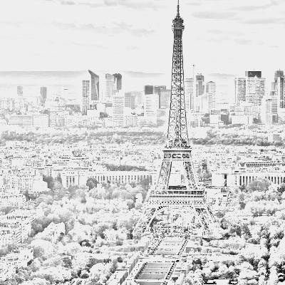

# Photo-Sketching

This project takes an image as input and converts into a sketch.
We can use sliders to change the output.

Files:

1. pencil_sketch.py: applies sketching on a folder.
2. pencil_sketch_realtime.py: applies sketching real time.

Usage:
```
To run:python pencil_sketch.py
Press:
1. 's': save current image sketch
2. 'q': quit
3. left or right arrow key: to move around the images
```

## Results

Image----------------->Result
Image             |  Result
:-------------------------:|:-------------------------:
  |  
  |  
  |  
